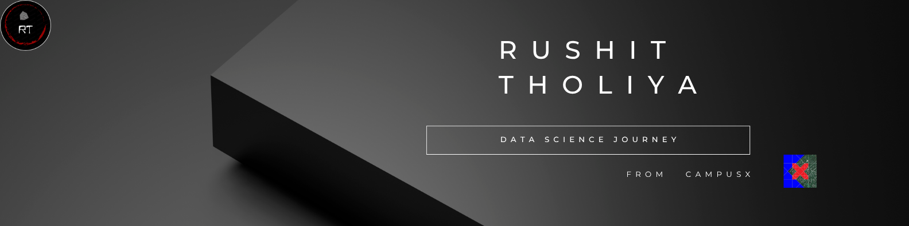

# Data Science — Structured Learning Log
> **Who:** Rushit Tholiya · 2nd year B.Tech (CS) at Nirma University, Ahmedabad
>
> **Why:** I want to build end-to-end ML projects — from raw data to a working model — and move into a data or ML engineering role after graduation. This repo is my daily proof-of-work.
>
> **How:** Working through the [CampusX 100-Days of ML](https://youtube.com/playlist?list=PLKnIA16_RmvbAlyx4_rdtR66B7EHX5k3z) course. For each lecture, I write my own notes *before* watching the solution, then compare.
---
## How this repository reflects my learning
- I write notes **in my own words** before watching the solution video
- Every task has a comment block at the top: what I tried, where I got stuck, what I learned
- I track *actual mistakes* — not just the polished final answer
- Notebooks include my own **additional experiments** beyond the assigned tasks
---
## Progress
| Module | Lectures | Tasks Solved | Status |
|---|---|---|---|
| Python Basics | 12 / 12 | 12 / 12 | ✅ Complete |
| NumPy | 3 / 3 | 3 / 3 | ✅ Complete |
| Pandas | 3 / 7 | 3 / 7 | ✅ Complete |
| matplotlib | 2 / 2 | 2 / 2 | ✅ Complete |
| seaborn | 2 / 2 | - | ✅ Complete  |
| Data Analysis Process | 0 / 3 | 0 / 3 | ⏳ Upcoming  |
| SQL | 9 / 9 | 9 / 9  | ✅ Complete |
| Statistics | 1 / 14 | 1 / 14 | ⏳ In progress |
| Machine Learning | 70 / 100+ | — | ⏳ In progress |
> Last updated: July 2026
---
## Repo structure
```
/
├── 01-python-basics/
│   ├── notes/       
│   └── tasks/        
├── 02-numpy/
├── 03-pandas/
├── 04-matplotlib/
├── 05-seaborn/
├── 06-data-analysis-process/
├── 07-SQL/
├── 08-statistics/
├── 09-machine-learning/
└── datasets/
```
---
## A few things I found genuinely interesting so far

- Python's `*args` and `**kwargs` — I wrote 6 small functions to test every edge case. Most useful when you genuinely don't know how many arguments a function will receive at call time.
- NumPy broadcasting confused me for 3 days. I finally understood it by drawing out the shape transformations by hand — see [`02-numpy/notes/S14_Advanced_Numpy.ipynb`](02-Numpy/notes/S14_Advanced_Numpy.ipynb)

There's a pattern in all three libraries — I know they exist, I use them constantly, and I *still* blank on the exact syntax under pressure. So instead of googling the same thing for the 50th time, I built a searchable quick-reference site for each:

| # | Library | What's inside | Live Preview | Source |
|---|---|---|---|---|
| 1 | 🐍 **Python** | All 69 built-ins, core methods, runnable examples | 🔗 [Open](https://python-quick-reference.netlify.app/) | [`.html`](01-python-basics/python-quick-reference.html) |
| 2 | 🔢 **NumPy** | Array creation, indexing, broadcasting, most-used functions | 🔗 [Open](https://numpy-quick-reference.netlify.app/) | [`.html`](https://github.com/Rushit004/data-science-journey-campusx/blob/main/02-Numpy/numpy-quick-reference.html) |
| 3 | 🐼 **Pandas** | DataFrame/Series methods, groupby, merging, string & datetime accessors, file I/O | 🔗 [Open](https://pandas-quick-reference.netlify.app/) | [`.html`](03-Pandas/pandas-quick-reference.html) |
| 4 | 📊 **Matplotlib & Seaborn** | Most-used plot types, one-liners for quick recall | 🔗 [Open](https://matplotlib-and-seaborn-graphs.netlify.app/) | [`.html`](04-Matplotlib/matplotlib_seaborn_graphs.html) |

---
## 🎛️ Interactive ML Demos

Alongside notes and notebooks, I'm building small interactive apps to actually *feel* how ML concepts behave under different settings, instead of just reading about them:

- **Linear Regression — Hyperparameter Tuning** — a Streamlit app to tune hyperparameters (learning rate, iterations, etc.) and watch their effect on the model live → 🔗 [Open the demo](https://hyperparameters-tuning.streamlit.app/)

- **Decision Tree Classifier — Hyperparameter Tuning** — a Streamlit app to tune hyperparameters (criterion, max depth, min samples split, etc.) and visualize the decision boundary live → 🔗 [Open the demo](https://decision-tree-classifier-demo.streamlit.app/)
  
- **Decision Tree Regressor — Hyperparameter Tuning** — a Streamlit app to tune hyperparameters (criterion, max depth, min samples split, etc.) and watch the regression fit change live → 🔗 [Open the demo](https://decision-tree-regression-demo.streamlit.app/)

- **Bagging Classifier — Base Estimator Comparison** — a Streamlit app to tune bagging hyperparameters (n_estimators, max samples, bootstrap, etc.) and compare the decision boundary against a single base estimator → 🔗 [Open the demo](https://bagging-classifier.streamlit.app/)
  
- **Bagging Regressor — Base Estimator Comparison** — a Streamlit app to tune bagging hyperparameters (n_estimators, max samples, bootstrap, etc.) and compare the regression fit against a single base estimator → 🔗 [Open the demo](https://bagging-regression.streamlit.app/)

- **Random Forest Classifier — Hyperparameter Tuning** — a Streamlit app to tune random forest hyperparameters (n_estimators, max features, bootstrap, max samples, etc.) and visualize the decision boundary live → 🔗 [Open the demo](https://random-forest-classifier-demo.streamlit.app/)
---
## Environment
```
Python 3.11  ·  Jupyter Notebook / JupyterLab / Google Colab
NumPy  ·  Pandas  ·  Matplotlib  ·  Seaborn  ·  Scikit-learn
```
## Clone and run locally:
1. Create a new folder on your system and open it in the terminal.
2. Clone the repository:
```
git clone https://github.com/Rushit004/data-science-journey-campusx.git
```
3. Move into the project folder:
```
cd data-science-journey-campusx
```
4. Install the required libraries:
```
pip install numpy pandas matplotlib seaborn scikit-learn jupyterlab
```
5. Launch Jupyter Lab:
```
jupyter lab
```
After running the above commands, Jupyter Lab will open in your browser, where you can explore all the notebooks and work.
---
## About me
Rushit  Tholiya
🔗 [LinkedIn](https://linkedin.com/in/rushit-tholiya-605341311) 
🔗 [GitHub profile](https://github.com/Rushit004)
---
*Live repo — updated as I progress. Feedback and suggestions welcome via Issues.*
